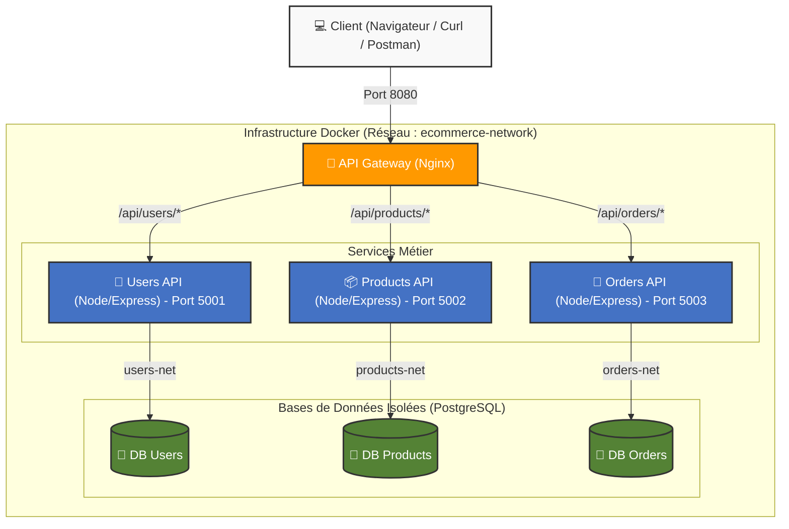

# Schéma d'Architecture - Projet Docker "Microservices from Scratch"

## Vue d'ensemble de l'Infrastructure

L'application est décomposée en 3 microservices métier totalement indépendants, et orchestrés via Docker Compose sur un réseau commun nommé `ecommerce-network`. Chaque service API possède sa propre base de données isolée et n'est pas accessible de l'extérieur sans passer par le point d'entrée unique (API Gateway Nginx).

## Communications Inter-Services

- Le service **Orders API** (port `5003`) a besoin de récupérer des informations sur un produit lors de la création d'une commande (vérification du stock et calcul du prix). Pour cela, il communique de manière synchrone (HTTPS/HTTP) avec le service **Products API**, via le réseau interne Docker (`ecommerce-network`).
- Il n'y a **aucun lien direct** entre les différentes bases de données. Pour des raisons d'indépendance, les bases de données sont placées sur des sous-réseaux Docker exclusifs (`users-net`, `products-net`, `orders-net`).
